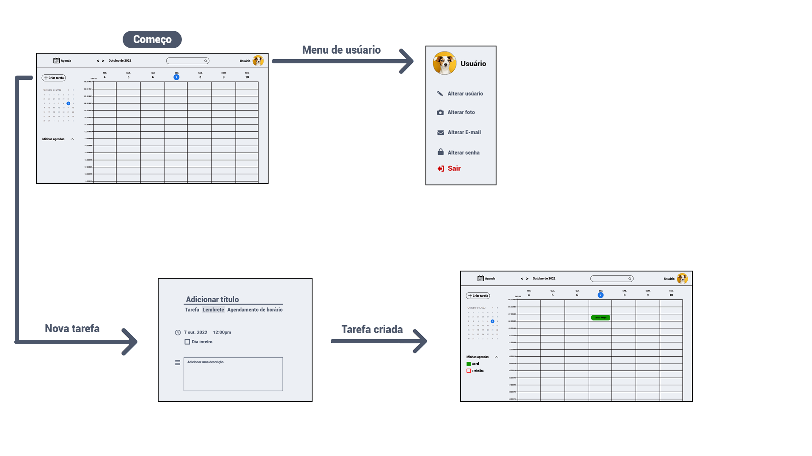
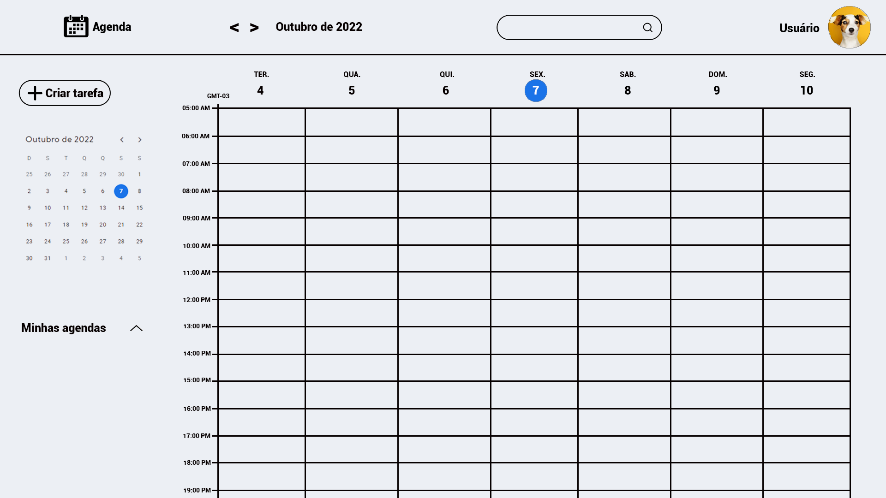
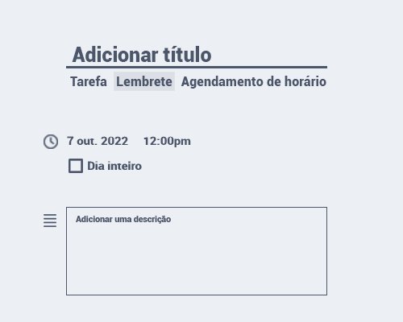
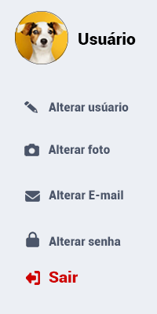

# Projeto de Interface

Pré-requisitos: <a href="2-Especificação do Projeto.md"> Documentação de Especificação</a>

Nesta etapa será apresentado uma visão geral da interação do usuário pelas telas do sistema e protótipo interativo das telas com as funcionalidades que fazem parte do sistema (wireframes).

## User Flow

Fluxo de usuário (User Flow) é uma técnica que permite ao desenvolvedor mapear todo fluxo de telas do site ou app. Essa técnica funciona para alinhar os caminhos e as possíveis ações que o usuário pode fazer junto com os membros de sua equipe.

## Wireframes

Página inicial:

A página principal será o centro do nosso projeto, nele será exibido sua agenda separado por dia e horário mantendo suas atividades separadas, também será possível selecionar a data que deseja ter visualizar em um calendário cituado na parte central esquerda, além de ter acesso as outras abas como de pesquisa, criação de atividades e perfil.

Criar nova tarefa:

Nesta aba será possível realizar a criação da atividades, com titulo, selecionando data e hora e também adicionando uma descrição a elas.

Tela de usúario:

Na parte de usuário, será possível alterar o nome de seu perfi, foto, e-mail e também a senha de usuário.
