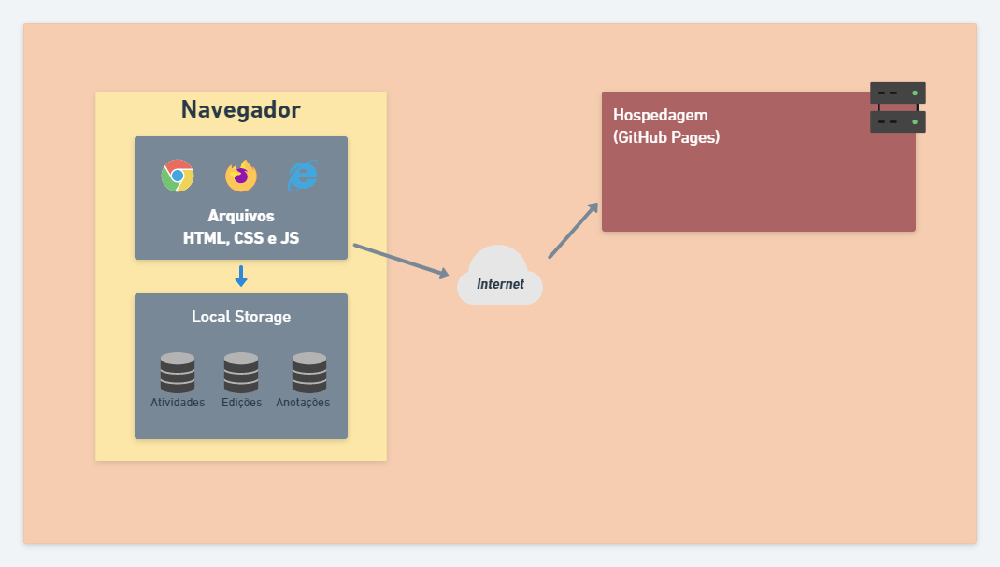

# Arquitetura da Solução

Pré-requisitos: <a href="3-Projeto de Interface.md"> Projeto de Interface</a>

Nesta etapa será definido os detalhes da solução encontrada pela equipe referente ao ambiente de hospedagem.

## Diagrama de componentes

Através do diagrama a seguir é possível visualizar seus componentes e relacionamentos entre os mesmos.

Exemplo: 

Os componentes que fazem parte da solução são apresentados na Figura 01.

Figura 01 - Arquitetura da Solução

A solução implementada conta com os seguintes módulos:
- **Navegador** - Interface básica do sistema  
  - **Páginas Web** - Conjunto de arquivos HTML, CSS, JavaScript e imagens que implementam as funcionalidades do sistema.
   - **Local Storage** - armazenamento mantido no Navegador, onde são implementados bancos de dados baseados em JSON. São eles: 
     - **Atividades** - registro de atividades criadas
     - **Edições** - edições realizadas nas atividades
     - **Anotações** - anotações criadas nas atividades
 - **Hospedagem** - local na Internet onde as páginas são mantidas e acessadas pelo navegador. 

## Tecnologias Utilizadas

- Linguagens utlizadas para desenvolver o projeto: HTML, CSS, JavaScript
- IDEs de desenvolvimento: PyCharm e Visual Studio Code
- Plataforma para hospedagem do site e arquivos: GitHub Pages
- Ferramenta para crição de template: MarvelApp e Whimsical

## Hospedagem

O GitHub Pages será utilizado como ambiente de hospedagem do site do projeto. A publicação é feita através de comandos via git para o repositório em que os arquivos se encontram.
